# Understanding Neural Networks: A Complete Beginner's Guide

This guide will teach you the fundamentals of neural networks by building one from scratch using only NumPy. By the end, you'll understand how machines can learn to recognize handwritten digits!

---

## Table of Contents

1. [What is a Neural Network?](#what-is-a-neural-network)
2. [The Building Blocks: Neurons](#the-building-blocks-neurons)
3. [Network Architecture](#network-architecture)
4. [Forward Propagation](#forward-propagation)
5. [Activation Functions](#activation-functions)
6. [Loss Functions](#loss-functions)
7. [Backpropagation](#backpropagation)
8. [Gradient Descent](#gradient-descent)
9. [The MNIST Dataset](#the-mnist-dataset)
10. [Putting It All Together](#putting-it-all-together)

---

## What is a Neural Network?

A neural network is a computing system loosely inspired by biological brains. It's a mathematical function that learns patterns from data.

```mermaid
graph LR
    subgraph Input["📥 Input"]
        I1[Image of '3']
    end
    subgraph NN["🧠 Neural Network"]
        N1[Learns patterns]
    end
    subgraph Output["📤 Output"]
        O1["Prediction: 3"]
    end
    I1 --> N1 --> O1
```



**Key Insight:** A neural network is just a series of mathematical operations (multiplications and additions) that transform input data into useful predictions.

---

## The Building Blocks: Neurons

### What is a Neuron?

A neuron (also called a "node" or "unit") is the fundamental building block. It does three things:

1. **Receives inputs** (numbers)
2. **Performs a calculation** (weighted sum + bias)
3. **Outputs a result** (after applying an activation function)

```mermaid
graph LR
    subgraph Inputs
        x1["x₁ = 0.5"]
        x2["x₂ = 0.3"]
        x3["x₃ = 0.8"]
    end

    subgraph Weights
        w1["w₁ = 0.4"]
        w2["w₂ = -0.2"]
        w3["w₃ = 0.7"]
    end

    subgraph Neuron["🔵 Neuron"]
        sum["Σ (weighted sum)"]
        act["Activation f(z)"]
    end

    x1 --> |"× w₁"| sum
    x2 --> |"× w₂"| sum
    x3 --> |"× w₃"| sum
    sum --> |"+bias"| act
    act --> output["Output: 0.73"]
```



### The Math Behind a Neuron

```
z = (x₁ × w₁) + (x₂ × w₂) + (x₃ × w₃) + bias
output = activation_function(z)
```

**Example calculation:**
```
z = (0.5 × 0.4) + (0.3 × -0.2) + (0.8 × 0.7) + 0.1
z = 0.2 + (-0.06) + 0.56 + 0.1
z = 0.8
output = activation(0.8)  # e.g., 0.73 using sigmoid
```

---

## Network Architecture

A neural network organizes neurons into **layers**:

```mermaid
graph LR
    subgraph Input_Layer["Input Layer (784 neurons)"]
        i1((i₁))
        i2((i₂))
        i3((i₃))
        i4((...))
        i784((i₇₈₄))
    end

    subgraph Hidden_Layer["Hidden Layer (128 neurons)"]
        h1((h₁))
        h2((h₂))
        h3((...))
        h128((h₁₂₈))
    end

    subgraph Output_Layer["Output Layer (10 neurons)"]
        o0((0))
        o1((1))
        o2((...))
        o9((9))
    end

    i1 & i2 & i3 & i4 & i784 --> h1 & h2 & h3 & h128
    h1 & h2 & h3 & h128 --> o0 & o1 & o2 & o9
```



### Layer Types

| Layer | Purpose | For MNIST |
|-------|---------|-----------|
| **Input Layer** | Receives raw data | 784 neurons (28×28 pixels) |
| **Hidden Layer(s)** | Learns patterns/features | 128 neurons (we choose this) |
| **Output Layer** | Makes predictions | 10 neurons (digits 0-9) |

### Why "Hidden" Layers?

Hidden layers are called "hidden" because we don't directly observe their values - they're internal to the network. They learn intermediate representations:

```mermaid
graph TD
    subgraph Layer1["Input: Raw Pixels"]
        P["⬜⬜⬛⬛⬜<br/>⬜⬛⬜⬜⬛<br/>⬜⬛⬜⬜⬛<br/>⬜⬜⬛⬛⬜"]
    end

    subgraph Layer2["Hidden: Learned Features"]
        F1["Detects edges"]
        F2["Detects curves"]
        F3["Detects loops"]
    end

    subgraph Layer3["Output: Classification"]
        C["It's an 8!"]
    end

    P --> F1 & F2 & F3
    F1 & F2 & F3 --> C
```



---

## Forward Propagation

Forward propagation is the process of passing input through the network to get an output.

```mermaid
flowchart LR
    subgraph Step1["Step 1"]
        A["Input Image<br/>(784 values)"]
    end

    subgraph Step2["Step 2"]
        B["Multiply by<br/>Weights W₁"]
        C["Add Bias b₁"]
        D["Apply ReLU"]
    end

    subgraph Step3["Step 3"]
        E["Multiply by<br/>Weights W₂"]
        F["Add Bias b₂"]
        G["Apply Softmax"]
    end

    subgraph Step4["Step 4"]
        H["Output<br/>Probabilities"]
    end

    A --> B --> C --> D --> E --> F --> G --> H
```



### In Code Terms

```python
# Forward propagation step by step
z1 = X.dot(W1) + b1      # Linear transformation
a1 = relu(z1)             # Activation (hidden layer)
z2 = a1.dot(W2) + b2      # Linear transformation
a2 = softmax(z2)          # Activation (output layer)
# a2 contains our predictions!
```

---

## Activation Functions

Activation functions introduce **non-linearity**, allowing neural networks to learn complex patterns.

### Without Activation Functions

Without activation functions, a neural network is just a linear transformation - it could only learn straight-line relationships!

### ReLU (Rectified Linear Unit)

```
ReLU(x) = max(0, x)
```

```
     ▲ output
     │      ╱
     │     ╱
     │    ╱
─────┼───╱────► input
     │  ╱
     │ ╱ (negative values become 0)
     │╱
```

**Why ReLU?**
- Simple and fast to compute
- Helps with the "vanishing gradient" problem
- Works great for hidden layers

### Softmax

Converts raw scores into probabilities (they sum to 1):

```
softmax(x_i) = e^(x_i) / Σ e^(x_j)
```

**Example:**
```
Raw scores:  [2.0, 1.0, 0.5]
After softmax: [0.59, 0.24, 0.17]  # Sum = 1.0
```


---

## Loss Functions

The loss function measures **how wrong** our predictions are. Our goal is to minimize it.

### Cross-Entropy Loss

For classification problems, we use cross-entropy loss:

```
Loss = -Σ y_true × log(y_predicted)
```

**Intuition:**
- If we predict 0.9 for the correct class → low loss (good!)
- If we predict 0.1 for the correct class → high loss (bad!)

```mermaid
graph TD
    subgraph Example1["Good Prediction"]
        A1["True label: 3"]
        B1["Predicted: 90% chance of 3"]
        C1["Loss: 0.105 ✓"]
    end

    subgraph Example2["Bad Prediction"]
        A2["True label: 3"]
        B2["Predicted: 10% chance of 3"]
        C2["Loss: 2.303 ✗"]
    end

    A1 --> B1 --> C1
    A2 --> B2 --> C2
```



---

## Backpropagation

Backpropagation is how neural networks **learn**. It calculates how much each weight contributed to the error.

### The Chain Rule

Backpropagation uses calculus (specifically the chain rule) to compute gradients:

```mermaid
flowchart RL
    subgraph Forward["Forward Pass"]
        direction LR
        X["Input X"] --> H["Hidden Layer"] --> O["Output"] --> L["Loss"]
    end

    subgraph Backward["Backward Pass (Gradients Flow Back)"]
        direction RL
        dL["∂Loss"] --> dO["∂Output"] --> dH["∂Hidden"] --> dX["∂Weights"]
    end
```



### Gradient Intuition

Think of it as asking: "If I slightly increase this weight, does the loss go up or down?"

```
     Loss
       ▲
       │    ╱╲
       │   ╱  ╲
       │  ╱    ╲
       │ ╱      ╲
       │╱        ╲
───────┼──────────────► weight
       │   ▲
       │   │
       │   └── We want to find this minimum!
```

The gradient tells us:
- **Direction**: Should we increase or decrease the weight?
- **Magnitude**: How much should we change it?

---

## Gradient Descent

Gradient descent is the **optimization algorithm** that updates weights to minimize loss.

### The Update Rule

```
new_weight = old_weight - learning_rate × gradient
```



```mermaid
flowchart TD
    subgraph GD["Gradient Descent Process"]
        A["1. Calculate Loss"] --> B["2. Compute Gradients<br/>(Backpropagation)"]
        B --> C["3. Update Weights<br/>(w = w - lr × gradient)"]
        C --> D["4. Repeat until<br/>loss is minimized"]
        D --> A
    end
```

### Learning Rate

The learning rate controls step size:

```
Learning Rate Too High:     Learning Rate Too Low:     Just Right:
       ▲                           ▲                        ▲
       │  ╱╲                       │  ╱╲                     │  ╱╲
       │ ╱  ╲                      │ ╱  ╲                    │ ╱  ╲
       │╱    ╲                     │╱    ╲                   │╱    ╲
   ────┼──────────             ────┼──────────           ────┼──────────
       │ ↗   ↖   Overshoots!       │→→→→  Too slow!         │  ↘↘↓ Converges!
```

---

## The MNIST Dataset

MNIST is a classic dataset of handwritten digits, perfect for learning!

### Dataset Structure


### Image Format

Each image is:
- **28 × 28 pixels** = 784 total pixels
- **Grayscale**: Values from 0 (black) to 255 (white)
- **Normalized**: We divide by 255 to get values between 0 and 1

```
Original Image (28×28):        Flattened (784 values):
┌─────────────────────┐        [0.0, 0.0, 0.1, 0.8, 0.9, ...]
│  ⬜⬜⬜⬛⬛⬜⬜⬜  │              ↓
│  ⬜⬜⬛⬛⬛⬛⬜⬜  │        Fed into neural network
│  ⬜⬛⬛⬜⬜⬛⬛⬜  │              ↓
│  ⬜⬛⬜⬜⬜⬜⬛⬜  │   ┌───────────────────────┐
│  ⬜⬛⬜⬜⬜⬜⬛⬜  │   │   Neural Network      │
│  ⬜⬜⬛⬜⬜⬛⬜⬜  │   │   784 → 128 → 10      │
│  ⬜⬜⬜⬛⬛⬜⬜⬜  │   └───────────────────────┘
└─────────────────────┘              ↓
    This is a "0"             Prediction: "0" (98% confident)
```

### One-Hot Encoding

Labels are converted to one-hot vectors:

```
Label: 3  →  [0, 0, 0, 1, 0, 0, 0, 0, 0, 0]
              0  1  2  3  4  5  6  7  8  9

Label: 7  →  [0, 0, 0, 0, 0, 0, 0, 1, 0, 0]
              0  1  2  3  4  5  6  7  8  9
```

---

## Putting It All Together

### Complete Training Loop


### Key Concepts Summary

| Concept | What It Does | Analogy |
|---------|--------------|---------|
| **Weights** | Store learned knowledge | Brain synapses |
| **Bias** | Shifts activation threshold | Sensitivity adjustment |
| **Forward Pass** | Makes predictions | Taking a test |
| **Loss Function** | Measures errors | Grading the test |
| **Backpropagation** | Finds what caused errors | Reviewing mistakes |
| **Gradient Descent** | Updates weights | Learning from mistakes |
| **Epoch** | One pass through all data | One study session |
| **Batch** | Subset of training data | Flash cards |
| **Learning Rate** | Step size for updates | Study intensity |

---

## Visual Summary: How Our Network Learns to Recognize Digits


---

## Next Steps

After understanding this implementation:

1. **Experiment**: Try changing the number of hidden neurons
2. **Add layers**: What happens with 2 hidden layers?
3. **Try different learning rates**: See how it affects training
4. **Move to frameworks**: Try PyTorch or TensorFlow

Now open `mnist_neural_network.py` to see the full implementation!

---

*This guide accompanies the pure NumPy neural network implementation for MNIST.*
